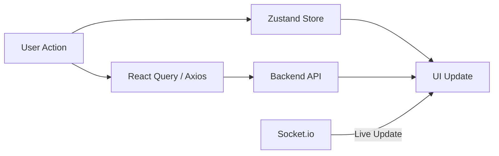

# Yapper 🗣️

In a world full of long-form articles and polished updates, **Yapper** is built for the "yappers." Whether it's a hot take on sports, a midnight epiphany, or just a stream-of-consciousness thread that nobody asked for—Yapper gives you the mic.

> **"Don't just post. Yap."** > We believe every thought deserves a thread. Yapper is your space to talk your talk, find your crowd, and yap freely without the filter.

---

<div align="center">


[Explore Features](#features) • [Install APK](#get-the-app) • [Tech Stack](#tech-stack) • [Project Structure](#project-structure)

</div>

---

## 📸 Screenshots

### Landing screen & Create account

<div align="center">


</div>

### Home feed & Search

<div align="center">


</div>

### Notifications

<div align="center">


</div>

### Chat

<div align="center">


</div>

### Profile

<div align="center">


</div>

---

## Overview

Yapper is a cross-platform mobile application built with **Expo** and **React Native**, offering a Twitter-like social media experience. The app features:

- 🔐 Secure authentication with multi-step sign-up and Google Sign-In
- 💬 Real-time messaging and chat with WebSocket support
- 📱 Beautiful, responsive UI with dark mode support
- 🌍 Multi-language support (English & Arabic) with full RTL support
- 🔔 Push and in-app notifications with aggregation
- 🖼️ Rich media support (images, videos, audio)
- 🧠 AI-powered tweet summarization
- ⚡ Optimized performance with caching and pagination
- 📊 Comprehensive testing and code quality checks
- 🚀 Automated CI/CD pipeline with EAS

---
## Get the App

Experience Yapper on your device today.

1.  **Download:** Head to the **[Latest Release](https://github.com/salehahmed99/yapper-mobile/releases/latest)**.
2.  **Install:** Download the `.apk` file for Android.
3.  **Scan:** (Optional) If you are using Expo Go, scan your development QR code here.

> ⚠️ **Note:** Ensure your device allows "Installation from Unknown Sources" for the APK. iOS support is available via TestFlight or the App Store in future releases.

---

## Features

### Authentication & Onboarding

- 🔐 Email/Phone/Username login
- 📱 Multi-step sign-up flow (X-style):
  - Name, email, birthdate
  - Email verification via OTP
  - Profile photo selection
  - “What should we call you?” screen
  - Language selection
  - Content preference onboarding
  - Recommendations / “Don’t miss out” step

- 🔑 Password reset functionality
- 🔐 Secure token storage with Expo Secure Store
- 🔄 Automatic token refresh
- 📱 Google Sign-In integration

---

### Tweets & Posting

- 📝 Create tweets, replies, quotes, and reposts
- ❤️ Like, bookmark, and interact with posts
- 🧵 Threaded replies displayed inline in the timeline
- 📣 Mention users in tweets
- 🖼️ Upload and display images and videos
- 🎥 Video autoplay with mute/unmute controls
- 🧠 AI-powered tweet summarization via Grok icon
- 🔢 View counts displayed on tweets
- Bottom sheet modals for reposts and post interactions

---

### Timeline & Feed

- 🏠 Home timeline with **For You** and **Following** feeds
- 🔄 Pull-to-refresh support
- ⚡ Paginated timeline for performance
- Thread-aware rendering of replies
- Smooth scrolling for media-heavy feeds

---

### Profiles

- 👤 Full user profiles with bio, stats, profile photo, and banner
- 📝 Edit profile modal for name, bio, location, website, date of birth, profile photo, and banner
- 👥 Followers and following lists with counts
- 🔄 Follow, unfollow, mute, and block functionality
- 📑 Profile tab layout: Tweets, Replies, Photos, Videos, Likes

---

### Real-Time Messaging (DMs)

- 💬 One-on-one real-time chat powered by WebSockets
- Text messages and voice notes
- Threaded replies
- Typing indicators
- Instant delivery without refresh
- X-style chat UI

---

### Notifications

- 🔔 In-app notifications triggered by: likes, reposts, replies, quotes, mentions
- Push notifications for all actions plus new messages
- Aggregation support:
  - By users (e.g., “Saleh and Mohamed liked your post”)
  - By posts (e.g., “Saleh liked 4 of your posts”)

- Centralized notification center

---

### Search & Explore

- 🔎 Full search for posts, users, hashtags, and posts by a specific user
- 🏷️ Explore tabs with categories: For You, Trending, News, Sports, Entertainment
- 📊 Dynamic trend detection
- 👥 User recommendations

---

### Settings & Preferences

- 🌓 Dark/light theme
- 🌍 Multi-language support (i18n) with full RTL support
- 🔔 Notification preferences
- 🔐 Privacy settings
- 📱 Account management

---

### Media & Rich Content

- 📸 Image uploads and gallery support
- 🎥 Video uploads and playback
- 🎵 Audio recording (voice notes)
- 📍 Location sharing
- 🖼️ Media caching for optimized performance

---

### Performance Optimization

- 🚀 Image caching with Expo Image
- 📦 Code splitting via Expo Router
- ⚡ Memoization with React.memo
- 🎯 FlatList optimization for large lists
- 💾 Persistent caching for API responses
- 🔄 Lazy loading of images and content

---

## Tech Stack

### Frontend

- **React Native** (v0.81.5) - Cross-platform mobile development
- **Expo** (v54.0.27) - Development platform and build service
- **Expo Router** (v6.0.17) - File-based routing system
- **React** (v19.1.0) - UI library
- **TypeScript** - Type-safe development
- **React Navigation** - Navigation management
- **React Query** (@tanstack/react-query) - Data fetching and caching
- **Zustand** - Lightweight state management
- **Zod** - TypeScript-first schema validation

### UI & Styling

- **Lucide React Native** - Icon library
- **React Native Tab View** - Tab navigation
- **React Native Modal Datetime Picker** - Date/time selection
- **Bottom Sheet** (@gorhom/bottom-sheet) - Bottom sheet modal
- **Expo Blur** - Blur effects
- **React Native Reanimated** - Animations

### Services & Features

- **Socket.io Client** - Real-time WebSocket communication
- **Axios** - HTTP client
- **i18next** - Internationalization
- **Expo Audio** - Audio recording
- **Expo Image Picker** - Media selection
- **Expo Notifications** - Push notifications
- **Google Sign-In** (@react-native-google-signin) - OAuth authentication
- **Phone Number Library** (libphonenumber-js) - Phone validation

### Development Tools

- **TypeScript** - Static type checking
- **ESLint** - Code linting
- **Prettier** - Code formatting
- **Jest** - Unit testing
- **Husky** - Git hooks
- **SonarQube** - Code quality analysis

---

## Project Structure

### Module Structure

Each feature module typically contains:

```
module-name/
├── components/          # UI components specific to module
├── containers/          # Container components
├── hooks/              # Custom hooks for module
├── services/           # API service calls
├── store/              # Zustand stores (if applicable)
├── types/              # TypeScript types
├── utils/              # Module utilities
└── __tests__/          # Module tests
```

### Component Architecture

Components are organized by responsibility:

- **Presentational Components** - Pure UI components in `components/`
- **Container Components** - Smart components with logic in `containers/`
- **Hooks** - Custom React hooks in `hooks/`
- **Services** - API and business logic in `services/`

### State Management

- **Local Component State** - `useState` for simple UI state
- **Context API** - Theme, Language, Shell state
- **Zustand** - Global app state (notifications, filters)
- **React Query** - Server state and caching

### API Communication

- **Axios** - HTTP client instance in `services/apiClient.ts`
- **Token Refresh** - Automatic token refresh in `services/tokenRefreshService.ts`
- **Socket.io** - Real-time WebSocket in `services/socketService.ts`

### Data Flow



---

## Getting Started

### Prerequisites

- **Node.js** (v18 or higher) - [Download](https://nodejs.org/)
- **npm** or **yarn** - Included with Node.js
- **Expo CLI** (optional but recommended)
  ```bash
  npm install -g expo-cli
  ```

### Installation

1. **Clone the repository**

   ```bash
   git clone https://github.com/salehahmed99/yapper-mobile.git
   cd yapper-mobile
   ```

2. **Install dependencies**

   ```bash
   npm install
   ```

3. **Configure environment variables** (if needed)
   - Create `.env` in the root directory
   - Add your API endpoints and keys

4. **Start the development server**
   ```bash
   npm start
   ```

### Run on Different Platforms

**Android Emulator**

```bash
npm run android
# or
expo run:android
```

**iOS Simulator** (macOS only)

```bash
npm run ios
# or
expo run:ios
```

**Web Browser**

```bash
npm run web
# or
expo start --web
```

**Expo Go** (Quick testing on physical device)

- Install [Expo Go](https://expo.dev/go) on your device
- Scan the QR code from terminal output with your device camera

---

## Available Scripts

### Development

| Command                 | Description                   |
| ----------------------- | ----------------------------- |
| `npm start`             | Start Expo development server |
| `npm run android`       | Run on Android emulator       |
| `npm run ios`           | Run on iOS simulator          |
| `npm run web`           | Run on web browser            |
| `npm run reset-project` | Reset project to fresh state  |

### Code Quality

| Command                | Description                     |
| ---------------------- | ------------------------------- |
| `npm run lint`         | Run ESLint to find issues       |
| `npm run lint:fix`     | Fix ESLint issues automatically |
| `npm run format`       | Format code with Prettier       |
| `npm run format:check` | Check code formatting           |
| `npm run type-check`   | Run TypeScript type checking    |

### Testing

| Command                 | Description                    |
| ----------------------- | ------------------------------ |
| `npm test`              | Run Jest tests in watch mode   |
| `npm run test:coverage` | Run tests with coverage report |

### Quality Analysis

| Command                | Description                              |
| ---------------------- | ---------------------------------------- |
| `npm run sonar`        | Run SonarQube analysis on main branch    |
| `npm run sonar:branch` | Run SonarQube analysis on current branch |

## Testing

### Running Tests

```bash
# Run all tests
npm test

# Run with coverage
npm run test:coverage

# Run specific test file
npm test -- src/modules/auth/__tests__/login.test.ts

# Run tests in watch mode (default)
npm test

# Run tests once
npm test -- --watchAll=false
```

### Test Organization

- Tests are located in `src/__tests__/` directory
- Test files follow naming pattern: `*.test.ts` or `*.spec.ts`
- Tests are organized by module matching the source structure

### Coverage Goals

- **Line Coverage**: ≥80%
- **Function Coverage**: ≥75%
- **Branch Coverage**: ≥70%

Coverage reports are generated in `coverage/` directory with HTML viewer.

---

## Code Quality

### ESLint

```bash
# Check for linting issues
npm run lint

# Fix issues automatically
npm run lint:fix
```

**ESLint Rules**:

- TypeScript ESLint recommended rules
- React and React Hooks best practices
- React Native specific rules
- Prettier integration for formatting consistency

### Prettier

```bash
# Format all files
npm run format

# Check if files are formatted
npm run format:check
```

**Formatting Configuration**:

- Single quotes
- Trailing commas
- 2-space indentation
- 100-character line width

### TypeScript

```bash
# Type checking without emitting
npm run type-check
```

**TypeScript Settings**:

- Strict mode enabled
- JSX handling for React Native
- Path aliases configured (`@/*`)

### SonarQube Analysis

```bash
# Run SonarQube analysis
npm run sonar

# Run on specific branch
npm run sonar:branch
```

**SonarQube Configuration**:

- Server: `http://localhost:9000`
- Project Key: `yapper-mobile`
- Coverage data from Jest LCOV reports

---

## Contributing

Please read [CONTRIBUTING.md](./CONTRIBUTING.md) for detailed contribution guidelines including:

- Git Flow workflow
- Branch naming conventions
- Pull request process
- Code quality standards
- CI/CD pipeline details

Quick contribution steps:

1. Fork the repository
2. Create feature branch: `git checkout -b feature/your-feature`
3. Make changes and commit with conventional messages
4. Push to your fork: `git push origin feature/your-feature`
5. Create Pull Request with description
6. Pass all checks and get approval
7. Squash and merge to develop

---

## Authors

This project was built with ❤️ by our amazing team:

<table>
  <tr>
    <th align="center">Photo</th>
    <th align="center">Name</th>
    <th align="center">GitHub</th>
    <th align="center">Role</th>
  </tr>
  <tr>
    <td align="center">
      
    </td>
    <td align="center"><b>Saleh Ahmed</b></td>
    <td align="center">
      <a href="https://github.com/salehahmed99">@salehahmed99</a>
    </td>
    <td align="center">Lead Developer</td>
  </tr>
  <tr>
    <td align="center">
      
    </td>
    <td align="center"><b>Karim Yasser</b></td>
    <td align="center">
      <a href="https://github.com/KarimmYasser">@KarimmYasser</a>
    </td>
    <td align="center">Developer</td>
  </tr>
  <tr>
    <td align="center">
      
    </td>
    <td align="center"><b>Abdallah Ayman</b></td>
    <td align="center">
      <a href="https://github.com/AbdallahAyman03">@AbdallahAyman03</a>
    </td>
    <td align="center">Developer</td>
  </tr>
  <tr>
    <td align="center">
      
    </td>
    <td align="center"><b>Ahmed Kamal</b></td>
    <td align="center">
      <a href="https://github.com/ahmedkamal14">@ahmedkamal14</a>
    </td>
    <td align="center">Developer</td>
  </tr>
  <tr>
    <td align="center">
      
    </td>
    <td align="center"><b>Mohamed Abdelaziem</b></td>
    <td align="center">
      <a href="https://github.com/MohamedAbdelaiem">@MohamedAbdelaziem</a>
    </td>
    <td align="center">Developer</td>
  </tr>
</table>

### Project Statistics

- 📅 **Project Started**: October 2025
- 📝 **Total Commits**: 595+
- 🏷️ **Latest Release**: v1.3.0 (December 2025)
- 👥 **Contributors**: 6 team members
- 🌿 **Active Branches**: 33

---

## Resources & Documentation

### Official Documentation

- [Expo Documentation](https://docs.expo.dev/)
- [React Native Docs](https://reactnative.dev/)
- [Expo Router Guide](https://docs.expo.dev/router/introduction/)
- [React Navigation](https://reactnavigation.org/)

### Tools & Libraries

- [TypeScript](https://www.typescriptlang.org/)
- [Zustand State Management](https://zustand-demo.vercel.app/)
- [React Query Documentation](https://tanstack.com/query/latest)
- [Socket.io Client](https://socket.io/docs/v4/client-api/)

### Community

- [Expo Discord](https://chat.expo.dev)
- [React Native Community](https://reactnative.dev/community/overview)

---

## Acknowledgments

We would like to thank:

- The **Expo** team for their amazing development platform
- The **React Native** community for continuous support and resources
- All contributors who helped shape this project
- Our mentors and advisors for their guidance

### Special Thanks

- [Expo](https://expo.dev) - For the incredible mobile development platform
- [React Native](https://reactnative.dev) - For making cross-platform development accessible
- [TypeScript](https://www.typescriptlang.org) - For type-safe JavaScript
- [Socket.io](https://socket.io) - For real-time communication capabilities

---

## License

This project is part of an academic/educational initiative.

**© 2025 Yapper Team. All rights reserved.**

Unauthorized copying, modification, distribution, or use of this software, via any medium, is strictly prohibited without explicit permission from the authors.

---

## Contact & Support

For questions, issues, or collaboration:

- 📧 **Email**: Contact any team member via GitHub
- 🐛 **Bug Reports**: [Open an issue](https://github.com/salehahmed99/yapper-mobile/issues)
- 💡 **Feature Requests**: [Start a discussion](https://github.com/salehahmed99/yapper-mobile/discussions)
- 📖 **Documentation**: Check the [CONTRIBUTING.md](./CONTRIBUTING.md) guide

---

<div align="center">

**Built with ❤️ by the Yapper Team**

</div>

---

**Last Updated**: December 26, 2025  
**Version**: 1.3.0  
**Project Start**: October 2025
